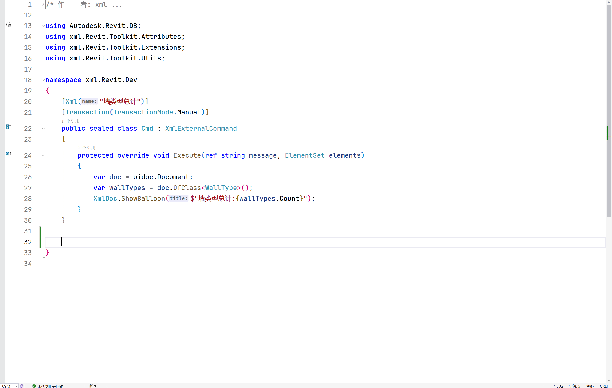

# .Net 平台上快速为 Revit 创建插件

<p align="center">
  <a href="https://www.nuget.org/packages/xml.Revit.Templates"></a>
  <a href="https://www.nuget.org/packages/xml.Revit.Templates"></a>
</p>

该模板包含用于快速创建 Revit 附加命令的项目模板

推荐使用拓展包 `https://www.nuget.org/packages/xml.Revit.Toolkit`

## Installation

1. 安装 [.Net SDK](https://dotnet.microsoft.com/download)
2. 运行 `dotnet new install xml.Revit.Templates` 安装更新项目模板

## code snipate

<p align="left">
    <picture>
        <source media="(prefers-color-scheme: dark)" width="750" srcset="assets/xmlRevitCommand.gif">
        
    </picture>
</p>

打开文件夹

`C:\Program Files\Microsoft Visual Studio\2022\Community\VC#\Snippets\2052\Visual C#`

在文件夹内新建 `xmlRevitCommand.snippet` 文件

并粘贴下方全部内容到此文件中后保存

```xml
<?xml version="1.0" encoding="utf-8"?>
<CodeSnippets xmlns="http://schemas.microsoft.com/VisualStudio/2005/CodeSnippet">
	<CodeSnippet Format="1.0.0">
		<Header>
			<Title>xmlRevitCmd</Title>
			<Shortcut>xmlRevitCmd</Shortcut>
			<Description>xml Revit Command 的代码片段</Description>
			<Author>xml</Author>
			<SnippetTypes>
				<SnippetType>Expansion</SnippetType>
				<SnippetType>SurroundsWith</SnippetType>
			</SnippetTypes>
		</Header>
		<Snippet>
			<Declarations>
				<Literal>
					<ID>name</ID>
					<ToolTip>类名</ToolTip>
					<Default>Test</Default>
				</Literal>
			</Declarations>
			<Code Language="csharp"><![CDATA[
			[Xml("功能名称")]
			[Transaction(TransactionMode.Manual)]
			public class Cmd$name$ : XmlExternalCommand
			{
				protected override void Execute(ref string message, ElementSet elements)
				{
					throw new NotImplementedException();
				}		
			}
			]]>
			</Code>
		</Snippet>
	</CodeSnippet>
</CodeSnippets>

```

重新启动 `Visual Studio 2022` 

输入 `xmlRevitCommand`命令可快速创建Revit功能命令
